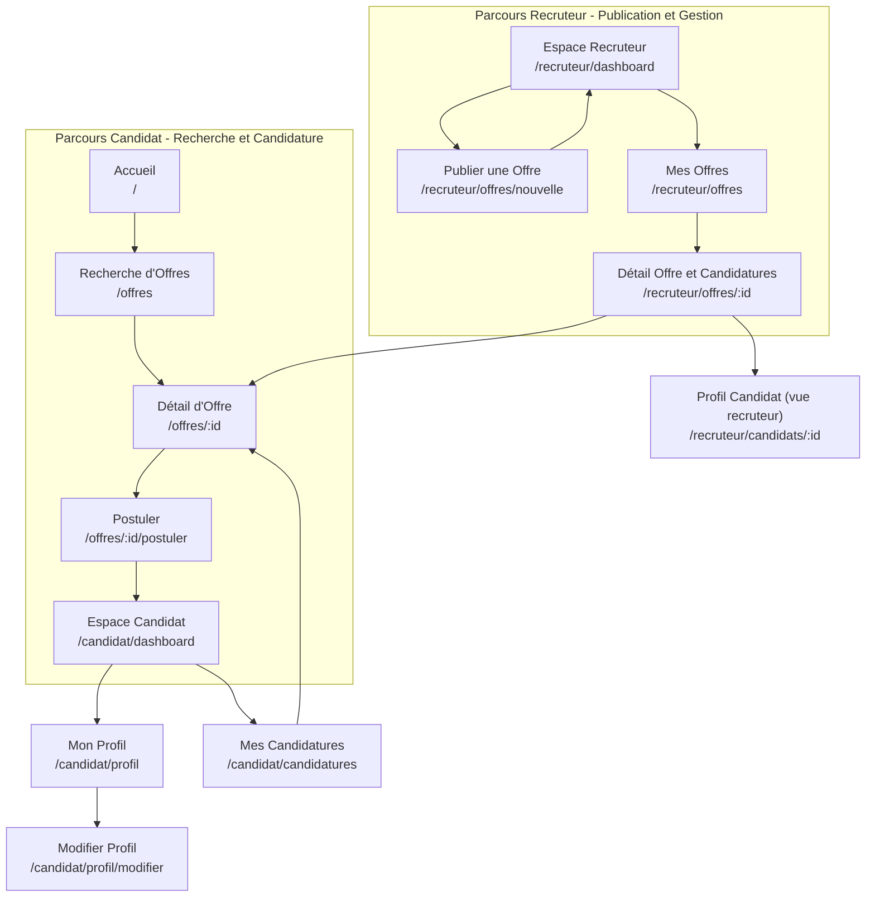

# User Flow — Plateforme de Recherche d'Emploi Guinée

```mermaid
graph TD
  %% Primary Pages (accessible from main navigation or direct links)
  PageA["Accueil<br/>/"]
  PageB["Recherche d'Offres<br/>/offres"]
  PageC["Espace Candidat<br/>/candidat/dashboard"]
  PageD["Espace Recruteur<br/>/recruteur/dashboard"]

  %% Recherche et Candidature Flow (Core Business Feature)
  subgraph "Parcours Candidat - Recherche et Candidature"
    PageA --> PageB
    PageB --> PageB1["Détail d'Offre<br/>/offres/:id"]
    PageB1 --> PageB2["Postuler<br/>/offres/:id/postuler"]
    PageB2 --> PageC
  end

  %% Gestion Profil Candidat
  PageC --> PageC1["Mon Profil<br/>/candidat/profil"]
  PageC --> PageC2["Mes Candidatures<br/>/candidat/candidatures"]
  PageC1 --> PageC3["Modifier Profil<br/>/candidat/profil/modifier"]

  %% Gestion Offres Recruteur (Core Business Feature)
  subgraph "Parcours Recruteur - Publication et Gestion"
    PageD --> PageD1["Publier une Offre<br/>/recruteur/offres/nouvelle"]
    PageD1 --> PageD
    PageD --> PageD2["Mes Offres<br/>/recruteur/offres"]
    PageD2 --> PageD3["Détail Offre et Candidatures<br/>/recruteur/offres/:id"]
  end

  PageD3 --> PageD4["Profil Candidat (vue recruteur)<br/>/recruteur/candidats/:id"]

  %% Cross-page Navigation
  PageD3 --> PageB1
  PageC2 --> PageB1
```
